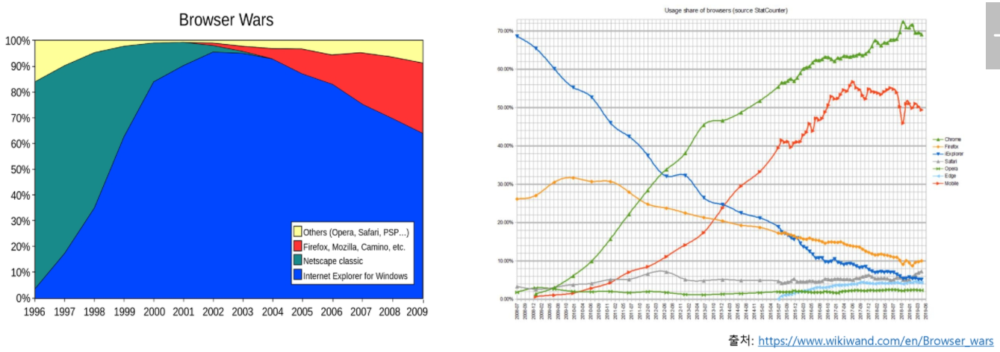
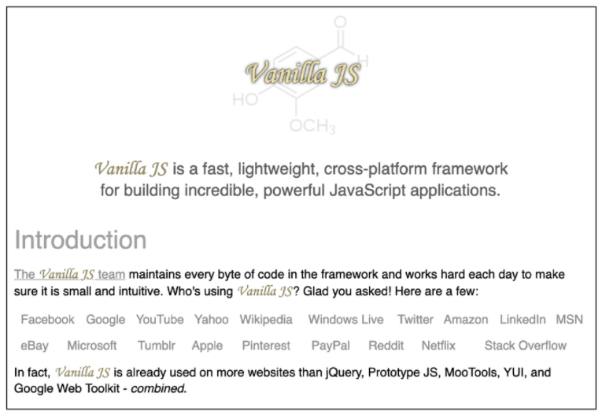
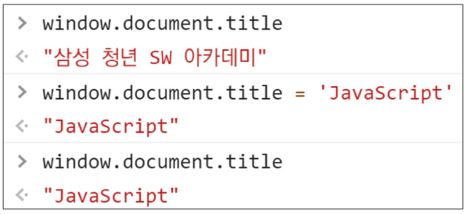
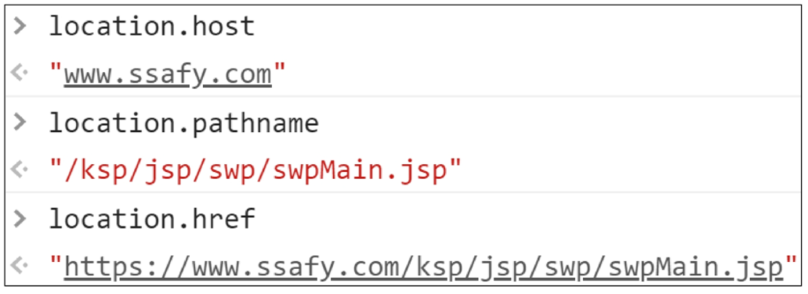
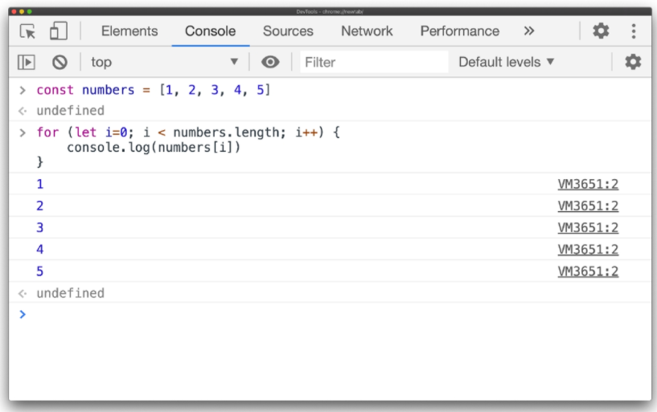
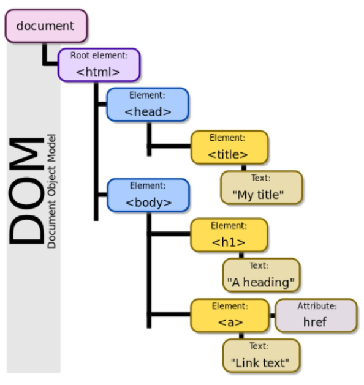
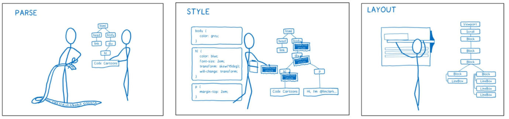
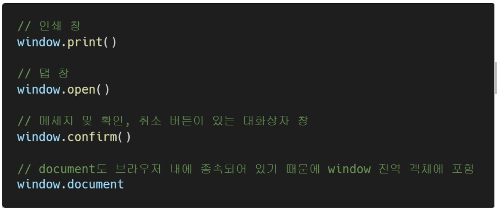
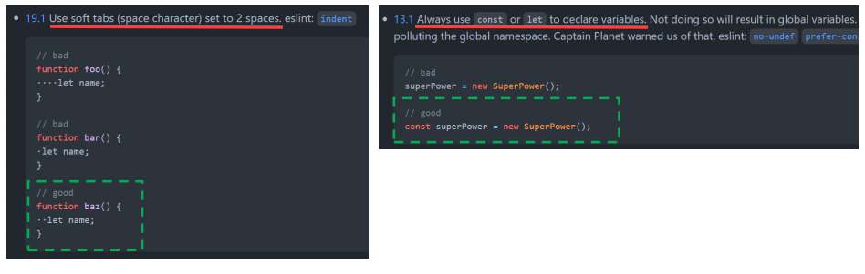

# 브라우저

- 웹 서버에서 이동하며 클라이언트와 서버간 양방향으로 통신하고, HTML 문서나 파일을 출력하는 GUI 기반의 소프트웨어
- 인터넷의 컨텐츠를 검색 및 열람하도록 함
- "웹 브라우저"라고도 함
- 주요 브라우저
  - 구글 크롬, 모질라 파이어폭스, 마이크로소프트 엣지, 오페라, 사파리 등


# JavaScript 핵심 인물

1. 팀 버너스피
   - WWW, URL, HTTP, HTML 최초 설계자
   - 웹의 아버지
2. 브랜던 아이크
   - JavaScript 최초 설계자
   - 모질라 재단 공동 설립자
   - 코드네임 피닉스 프로젝트 진행
     - 파이어폭스의 전신


# JS의 탄생

- 1994년 당시 넷스케이프 커뮤니케이션스사의 Netscape  Navigater(NN) 브라우저가 전 세계 점유율 80% 이상 독점하며 표준 역할을 함
- 당시 넷스케이프에 재직중이던 브랜던 아이크가 HTML을 동적으로 동작하기 위한 회사 내부 프로젝트를 진행 중 JS를 개발
- JavaScript 이름 변천사
  - Mocha => LiveScript => JavaScript(1995)
- 그러나 1995년 경쟁사 마이크로소프트에서 이를 채택해 자체적인 커스텀을 통해 Jscript를 만들어 IE 1.0에 탑재 => 1차 브라우저 전쟁의 시작


# 제 1차 브라우저 전쟁 (1996-2008)

- 넷스케이프 vs 마이크로소프트 (이하 MS)
- 빌 게이트 주도하에 MS는 1997년 IE 4를 발표하면서 시장을 장악하기 시작
  - 당시 윈도우의 시장점유육 90%
  - 글로벌 기업 MS의 공격적인 마케팅
- MS의 승리로 끝나며 2001년부터 IE의 점유율은 90%를 상회
- 1998년 넷스케이프에서 나온 브랜던 아이크 외 후계자들은 모질라 재단을 설립
  - 파이어 폭스를 통해 IE에 대항아며 꾸준히 점유율을 올려감
- MS의 폭발적 성장, IE3에서 자체적인 JScript를 지원, 호환성 문제로 크로스 브라우징 등의 이슈 발생
- 이후 Netscape 후계자들은 모질라 재단 기반의 Firefox를 개발



# 제 2차 브라우저 전쟁(2009~)

- MS vs Google
- 2008년 Google의 Chrome(이하 크롬) 브라우저 발표
- 2011년 3년 만에 파이어폭스의 점유율을 돌파 후 2012년 전세계 점유율 1위 탈환
- 크롬의 승리 요인
  - 압도적인 속도
  - 강력한 개발자 도구 제공
  - 웹 표준


# 파편화와 표준화

- 제 1차 브라우저 전쟁 이후 수많은 브라우저에서 자체 자바스크립트 언어를 사용하게 됨
- 결국 서로 다른 모습의 자바스크립트가 만들어 지면서 크로스 브라우징 이슈가 발생하여 웹 표준의 필요성이 제기
- 크로스 브라우징
  - W3C에서 채택된 표준 웹 기술을 채택해 서로 다른 브라우저에서 다르게 구현되는 기술을 비슷하게 만들며 웹 페이지를 제작하는 방법론 (동일성이 아닌 동등성)
  - 브라우저마다 렌더링에 사용하는 엔진이 다르기 때문

- 1996년부터 넷스케이프는 표준 제정에 대한 필요성을 주장
  - Ecma 인터내셔널(정보와 통신 시스템을 위한 국제적 표준화 기구)에 표준 제정 요청
- 1997년 ECMAScript1 (ES1) 탄생
- 제1차 브라우저 전쟁이후 문제된 언어의 파편화를 해결하기 위해 크롬의 등장 이후 각 브라우저 회사 및 재단은 표준화에 더욱 더 적극적으로 힘을 모으기 시작


# ECMA?

- ECMA(ECMA International)
  - 정보 통신에 대한 표준을 제정하는 비영리 표준화 기구
- ECMAScript는 RCMA에서  ECMA-262* 규격에 따라 정의한 언어
  - ECMA-262*: 범용적인 목적의 프로그래밍 언어에 대한 명세
- ECMAScript6는 ECMA에서 제안하는 6번째 표준 명세를 말함
  - (참고) ECMAScript6의 발표 연도에 따라 ECMASctipt2015라고도 불림


# 현재의 JS

- 2015년 ES2015 (ES6) 탄생
  - "Next-gen of JS"
  - JS의 고질적인 문제들을 해결
  - JS의 다음 시대라고 불리울 정도로 많은 혁신과 변화를 맞이한 버전
  - 이때부터 버전 순서가 아닌 출시년도를 붙이는 것이 공식 명칭이나 통상적으로 ES6라 부름
  - 현재는 대부분의 표준이 ES6+로 넘어옴


# Vanilla JavaScript

- 크로스 브라우징, 간편한 활용 등을 위해 많은 라이브러리 등장 (대표적 jQuery)
- 최근 표준화된 브라우저, ES6 이후의 다양한 도구의 등장으로 순수 자바스크립트 활용의 증대




# 결론 

- History of JanaScript & Browser
  - 브라우저 전쟁
  - 파편화 & 표준화의 투쟁
- 브라우저 전쟁의 여파
  - Cross Browsing Issue
  - 표준화(통합)을 위한 노력
  - Vanilla JavaScript


# 브라우저에서 할 수 있는 일

- DOM 조작
  - 문서 (HTML) 조작
- BOM 조작
  - navigator, screen, location, frames, history, XHR
- JavaScript Core (ECMASCript)
  - Data Structure(Object, Array), Conditional Expression, Iteration


# DOM (Document Object Model)




# BOM (Browser Object Model)




# JavaScript Core (프로그래밍 언어)




# DOM이란?

- HTML, XML 등과 같은 문서를 다루기 위한 언어 독립적인 문서 모델 인터페이스

- 문서를 구조화하고 구조화된 구성 요소를 하나의 객체로 취급하여 다루는 논리적 트리 모델

- 문서가 구조화되어 있으며 각 요소는 객체(object)로 취급

- 단순한 속성 접근, 메서드 활용 뿐만 아니라 프로그래밍 언어적 특성을 확용한 조작 가능

- 주요 객체

  - window: DOM을 표현하는 창. 가장 최상위 객체 (작성 시 생략 가능)
  - document: 페이지 콘텐츠의 Entry Point 역할을 하며, `<body>` 등과 같은 수많은 다른 요소들을 포함
  - navigator, location, history, screen

  

- DOM - 해석

  - Parsing(파싱)

    - 구문 분석, 해석
    - 브라우저가 문자열을 해석하여 DOM Tree로 만드는 과정

    


# BOM이란

- Browser Object Model
- 자바스크립트가 브라우저와 소통하기 위한 모델
- 브라우저의 창이나 프레임을 추상화해서 프로그래밍적으로 제어할 수 있도록 제공하는 수당
  - 버튼, URl 입력창, 타이틀 바 등 브라우저 윈도우 및 웹 페이지의 일부분을 제어 가능
- window 객체는 모든 브라우저로부터 지원받으며 브라우저 window 자체를 지칭




# 세미콜론

- 자바스크립트는 세미콜론을 선택적으로 사용 가능
- 세미콜론이 없을 경우 ASI*에 의해 자동으로 세미콜론이 삽입됨
  - ASI*: 자동 세미콜론 삽입 규칙(Automatic Semicolon Insertion)
- 본 수업에서는 자바스크립트의 문법 및 개념적 측면에 집중하기 위해 세미콜론을 사용하지 않고 진행


# 세미콜론 예시

```javascript
// 세미콜론이 있는 경우
const greeting = 'Hello, world!';
conslof.log(greeting);

// 세미콜론이 없는 경우
const greeting = 'Hello. world!'
console.log(greeting)
```


# 코딩 스타일 가이드

- 코딩 스타일의  핵심은 합의된 원칙과 일관성
  -  절대적인 하나의 정답은 없으며, 상황에 맞게 원칙을 정하고 일관성 있게 사용하는 것이 중요
- 코딩 스타일은 코드의 품질에 직결되는 중요한 요소
  - 나아가 코드의 가독성, 유지보수 또는 팀원과의 커뮤니케이션 등 개발 과정 전체에 영향을 끼침
- (참고) 다양한 자바스크립트 코딩 스타일 가이드
  - Airbnb Javascript Style Guide
  - Google Javascript Style Guide
  - standardjs


# 코딩 스타일 가이드 예시

- 본 수업에서는 Airbnb Style Guide를 중심으로 진행할 예정
  - 단, 가이드의 일부 항목은 문법 및 개념적 측면에 집중하기 위해 변형해서 사용




###  

